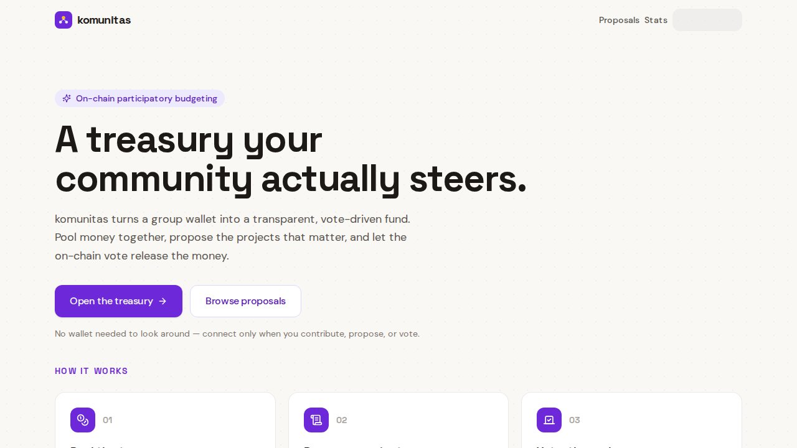
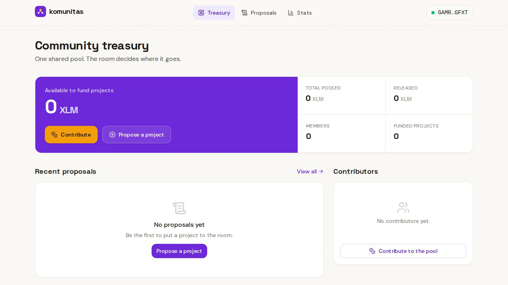
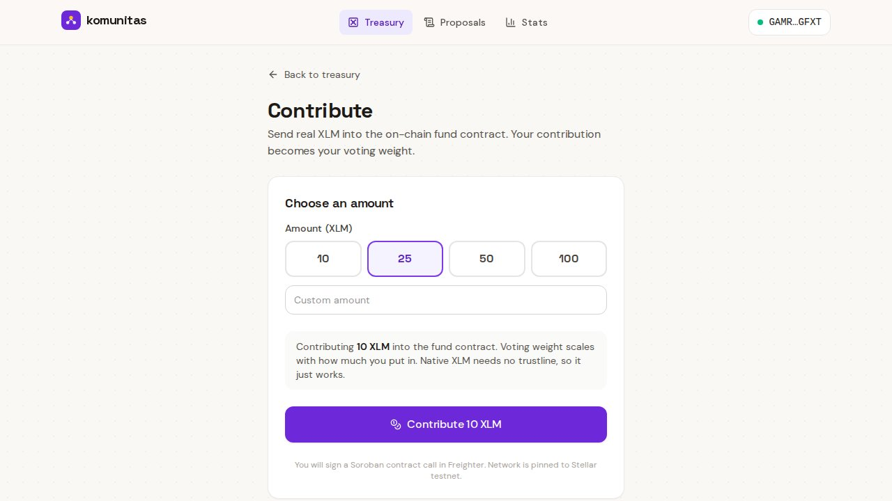
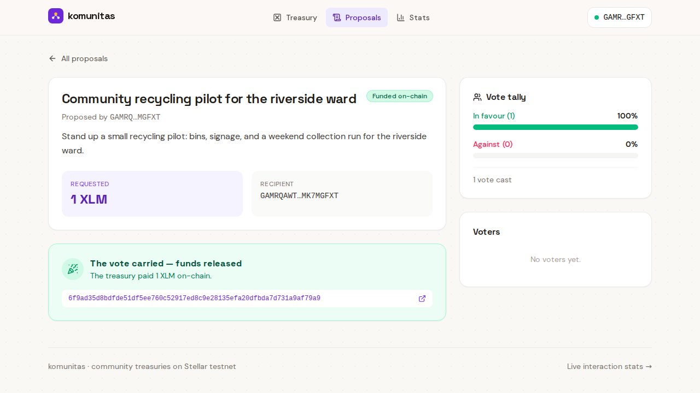
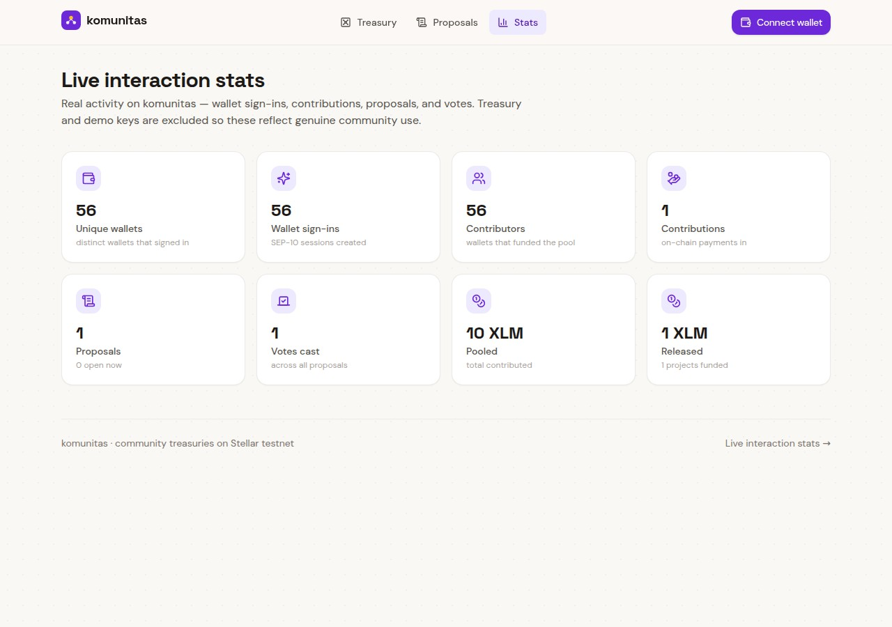
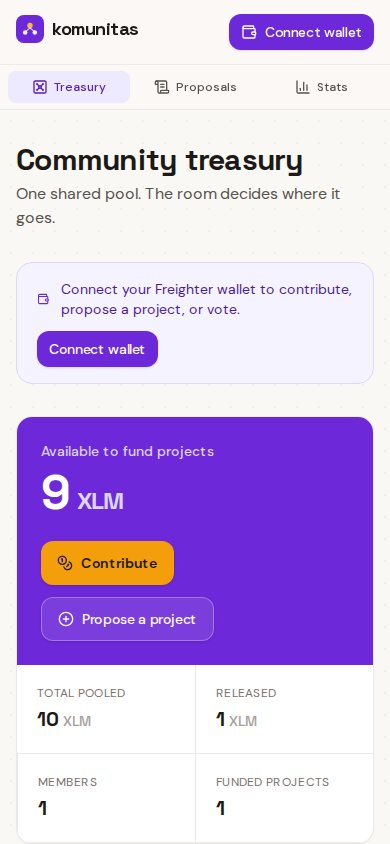
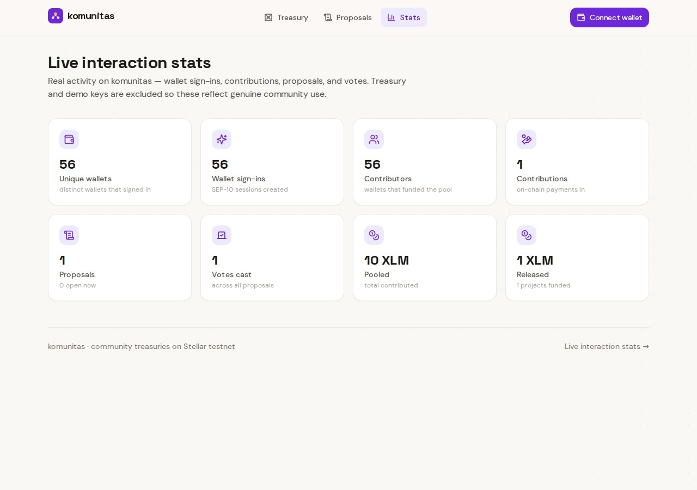

<div align="center">

# komunitas

### A treasury your community actually steers.

Pool value into one shared on-chain treasury, propose the projects that matter,
and let an open vote — not a treasurer — release the funds. Every contribution,
proposal, vote, and disbursement is a **real Soroban contract call** you can
verify on-chain.

[](https://komunitas-rho.vercel.app)

-f5b301?style=flat-square)


**→ [komunitas-rho.vercel.app](https://komunitas-rho.vercel.app)**



<br/>




<br/>




<br/>



<sub>Landing · Treasury dashboard · Contribute · Funded proposal · Stats · Mobile</sub>

</div>

---

## The idea

A neighbourhood fund usually lives or dies on one person: the treasurer. They hold the
money, they decide when it moves, and everyone else just has to trust the group chat.
There's no shared ledger and no rule that says *the room decided this*.

komunitas removes that single point of trust. Members pool value into **one deployed
Soroban smart contract** on Stellar testnet. Anyone can propose a project — what it is,
who gets paid, how much it needs. The community votes. The instant a proposal carries
a strict majority, **the contract itself disburses the grant to the recipient in the
same on-chain transaction** — with no one clicking a "send" button. What you get back
is a transaction hash on stellar.expert, not a promise.

---

## How it works

1. **Look around, no wallet required.** Browse the treasury, proposals and stats fully
   unconnected. You only connect a wallet when you want to *act*.
2. **Connect (SEP-10).** A challenge transaction is signed by your Freighter key and verified
   server-side. The signature is pinned to **testnet** regardless of your wallet's active
   network, so connect works even if Freighter is on mainnet.
3. **Contribute.** The server builds an unsigned `contribute(member, amount)` invocation
   of the `komunitas-fund` Soroban contract. You sign it in Freighter; the server submits
   it to Soroban RPC and polls until confirmed. Native XLM is the fund token — no trustline
   needed.
4. **Propose.** Any contributor triggers a signed `create_proposal(proposer, recipient, amount)`
   contract call. The contract assigns an on-chain proposal id; title and description metadata
   are stored alongside in the database.
5. **Vote → auto-disburse.** Members sign a `vote(voter, proposal_id, in_favor)` invocation.
   When the YES count crosses a strict majority of contributing members, the contract
   auto-disburses the grant to the recipient **inside the same transaction** — the winning
   vote and the payout are one atomic on-chain event. The proposal flips to **funded** with
   the transaction hash.

---

## What makes it real

- **Real deployed Soroban smart contract.** All contributions, proposals, votes, and
  disbursements are real contract invocations on Stellar testnet.
  Contract id: `CBVWE2OYZMFDMYN6DT5JMIJCUOIYABUAPONISO7EX7HSUTIYMNN67NIX` —
  [verify on stellar.expert](https://stellar.expert/explorer/testnet/contract/CBVWE2OYZMFDMYN6DT5JMIJCUOIYABUAPONISO7EX7HSUTIYMNN67NIX).
- **Atomic auto-disburse.** The winning vote and the fund release happen in one Soroban
  transaction; there is no separate treasury-keypair payment step.
- **XLM is the default; USDC is opt-in.** The contract uses the native XLM Stellar Asset
  Contract (SAC) — no trustline required. A one-tap **Enable USDC** builds and signs a classic
  `changeTrust` so members can hold USDC in their wallet.
- **Real data only.** Members, contributions, votes and proposals all come from real wallet
  activity. The DB is a mirror; the Soroban contract is the authoritative source of truth
  for balances, votes, and disbursement.
- **Designed states.** Loading, empty, error and success states are all handled — bad
  address, zero/negative amount, unfunded wallet, insufficient balance, expired session and
  mobile are each accounted for.

---

## Live stats



Real activity on komunitas — wallet sign-ins, contributions, proposals, and votes. Treasury and demo keys are excluded so these reflect genuine community use.

| metric | value |
|---|---|
| Unique wallets | 56 |
| Wallet sign-ins | 56 |
| Contributors | 56 |
| Contributions | 1 |
| Proposals | 1 (0 open) |
| Votes cast | 1 |
| Pooled | 10 XLM |
| Released | 1 XLM |

## Stellar integration

| Piece | How |
|---|---|
| **Wallet auth (SEP-10 style)** | Server issues a sequence-0 challenge tx; Freighter signs it; server verifies the signature with `Keypair.verify()` and sets an HttpOnly session cookie. Network passphrase pinned to testnet. |
| **Soroban smart contract** | Deployed `komunitas-fund` contract (`CBVWE2OYZMFDMYN6DT5JMIJCUOIYABUAPONISO7EX7HSUTIYMNN67NIX`) on Stellar testnet. Entrypoints: `contribute`, `create_proposal`, `vote` (auto-disburses on strict majority), `disburse` (admin fallback). Built with soroban-sdk 22, Rust 1.89.0, optimised wasm ~18 KB. |
| **Contributions** | Server builds an unsigned `contribute(member, amount)` contract invocation; member signs in Freighter; server submits to Soroban RPC (`soroban-testnet.stellar.org`) and polls until confirmed. |
| **Disbursement** | Auto-disbursement happens on-chain inside the `vote()` call the moment a strict majority is reached — one atomic Soroban transaction, no separate treasury keypair payment. |
| **Assets** | Native XLM via the XLM Stellar Asset Contract (SAC id: `CDLZFC3SYJYDZT7K67VZ75HPJVIEUVNIXF47ZG2FB2RMQQVU2HHGCYSC`). USDC opt-in via classic `changeTrust`. Amounts in stroops as `BigInt`. |
| **Explorer proof** | Every tx hash links to `stellar.expert/explorer/testnet`. The contract itself is browsable at the stellar.expert link above. |

---

## Frontend → Contract Wiring (where to look)

The chain from a button click to an on-chain Soroban transaction is real end to end. Every contract invocation is a `new Contract(getContractId()).call(method, ...args)` placed in a `TransactionBuilder` and simulated via `server.prepareTransaction(tx)`; every signed XDR is re-submitted via `server.sendTransaction(tx)` and polled with `server.getTransaction(hash)`. There are no stubs, no mock signatures, and no server-side keypair signing on the member's behalf.

Contract id: `CBVWE2OYZMFDMYN6DT5JMIJCUOIYABUAPONISO7EX7HSUTIYMNN67NIX` — methods: `contribute`, `create_proposal`, `vote`, `disburse`, `get_proposal`.

**`src/server/controller/fund.controller.ts`** — HTTP boundary for contribute (and a classic `changeTrust` for the optional USDC opt-in). Phase 1 returns the unsigned XDR for Freighter; phase 2 submits the wallet-signed XDR to Soroban RPC.

```ts
export async function prepareContributionHandler(req: NextRequest, ctx: RouteContext) {
  const body = prepareSchema.parse(await req.json());
  const out = await fundService.prepareContribution(ctx.publicKey!, body.amountStroops);
  return ok(out);
}

export async function submitContributionHandler(req: NextRequest, ctx: RouteContext) {
  const { signedXdr, amountStroops } = submitSchema.parse(await req.json());
  const out = await fundService.submitContribution(ctx.publicKey!, signedXdr, amountStroops);
  return created(out);
}
```

**`src/server/controller/proposal.controller.ts`** — wires the create_proposal + vote endpoints. `submitVote` reads the authoritative on-chain tally (`get_proposal`) and mirrors it into the DB; the same submit may auto-disburse to the recipient inside the vote transaction.

```ts
export async function prepareVote(req: NextRequest, ctx: RouteContext) {
  const id = ctx.params?.id ?? '';
  const { inFavor } = prepareVoteSchema.parse(await req.json());
  const out = await proposalService.prepareVote(id, ctx.publicKey!, inFavor);
  return ok(out);
}

export async function submitVote(req: NextRequest, ctx: RouteContext) {
  const id = ctx.params?.id ?? '';
  const { signedXdr, inFavor } = submitVoteSchema.parse(await req.json());
  const proposal = await proposalService.submitVote(id, ctx.publicKey!, signedXdr, inFavor);
  return created({ proposal });
}
```

**`src/server/service/fund.service.ts`** — builds the unsigned `contribute(member, amount)` Soroban invocation, then on submit mirrors the on-chain result into Postgres.

```ts
async prepareContribution(publicKey: string, amountStroops: string) {
  if (!/^\d+$/.test(amountStroops) || BigInt(amountStroops) < MIN_STROOPS) {
    throw new AppError('INVALID_INPUT', 'Minimum contribution is 0.1 XLM', 400);
  }
  const xdr = await prepareInvoke(publicKey, 'contribute', addr(publicKey), i128(amountStroops));
  return { xdr };
}

async submitContribution(publicKey: string, signedXdr: string, amountStroops: string) {
  ...
  const { hash: txHash } = await submitSigned(signedXdr);
  ...
  logger.info(`Contribution ${amountStroops} XLM from ${publicKey} via contract tx ${txHash}`);
  return { txHash, amountStroops, assetCode: 'XLM' as const, deposit: dep };
}
```

**`src/server/service/proposal.service.ts`** — builds the unsigned `vote(voter, proposal_id, in_favor)` and `create_proposal(proposer, recipient, amount)` invocations.

```ts
async prepareVote(proposalId: string, voterPublicKey: string, inFavor: boolean) {
  ...
  const xdr = await prepareInvoke(
    voterPublicKey,
    'vote',
    addr(voterPublicKey),
    u64(proposal.onchainId),
    bool(inFavor),
  );
  return { xdr };
}
```

**`src/server/stellar/contract.ts`** — the single Soroban entrypoint. `Contract.new + server.prepareTransaction` for prepare; `server.sendTransaction + server.getTransaction` polling for submit. Also `readContract` uses `server.simulateTransaction` for the read-only `get_proposal` mirror.

```ts
const contract = new Contract(getContractId());
const tx = new TransactionBuilder(account, {
  fee: BASE_FEE,
  networkPassphrase: getNetworkPassphrase(),
})
  .addOperation(contract.call(method, ...args))
  .setTimeout(180)
  .build();

const prepared = await server.prepareTransaction(tx);
return prepared.toXDR();

let sent = await server.sendTransaction(tx);
while (sent.status === 'TRY_AGAIN_LATER' && resend < 3) {
  await sleep(2000);
  sent = await server.sendTransaction(tx);
  resend += 1;
}
let result = await server.getTransaction(hash);
while (result.status === rpc.Api.GetTransactionStatus.NOT_FOUND && attempts < 30) {
  await sleep(1500);
  result = await server.getTransaction(hash);
  attempts += 1;
}
if (result.returnValue) returnValue = scValToNative(result.returnValue);
return { hash, returnValue };
```

**`src/server/stellar/index.ts` + `src/server/stellar/network.ts`** — re-export shim plus RPC client setup.

```ts
export function getRpcServer(): rpc.Server {
  return new rpc.Server(env.SOROBAN_RPC_URL, { allowHttp: false });
}
export function getContractId(): string {
  return env.SOROBAN_CONTRACT_ID;
}
```

**Browser side** — `src/lib/wallet.ts` calls Freighter's `signTransaction(xdr, { networkPassphrase })` (network pinned to testnet). `src/lib/api.ts` POSTs the unsigned build request to `/api/fund/contribute/prepare`, then the wallet-signed XDR to `/api/fund/contribute/submit`. Same shape for `/api/proposals/prepare`, `/api/proposals/submit`, `/api/proposals/[id]/vote/prepare`, `/api/proposals/[id]/vote/submit`.

---

## Tech stack

- **Next.js 16** (App Router, React 19, TypeScript strict)
- **Tailwind v4** with a custom civic palette (warm stone + brand green + amber)
- **Drizzle ORM** on PostgreSQL — `sessions`, `auth_nonces`, `members`, `deposits`,
  `proposals` (+ `onchain_id`, `create_tx_hash`), `votes` (+ `stellar_tx_hash`), `fund_pool`
- **@stellar/stellar-sdk** (incl. `rpc.Server`, `Contract`, `scVal` helpers) for Soroban
  tx building, RPC calls, and SEP-10 auth; **@stellar/freighter-api** v6 for signing
- **komunitas-fund Soroban contract** — Rust crate, soroban-sdk 22, built with Rust 1.89.0,
  optimised wasm ~18 KB, 10 unit tests
- **jose** for session JWTs, **tweetnacl** for nonce verification
- **Vitest** unit tests + **Playwright** prod e2e (real on-chain run against the live URL)

---

## Routes

| Path | What |
|---|---|
| `/` | Landing — pitch, live treasury totals, how-it-works |
| `/dashboard` | Treasury overview: pool balance, members, recent contributions |
| `/dashboard/contribute` | Contribute XLM into the treasury |
| `/proposals` | All proposals with live vote tallies |
| `/proposals/new` | Create a proposal |
| `/proposals/[id]` | Proposal detail + vote + release status |
| `/stats` | Public interaction stats |
| `POST /api/fund/contribute/prepare` | Build unsigned `contribute()` invocation |
| `POST /api/fund/contribute/submit` | Submit signed contribute, poll Soroban RPC |
| `POST /api/proposals/prepare` | Build unsigned `create_proposal()` invocation |
| `POST /api/proposals/submit` | Submit signed create_proposal |
| `POST /api/proposals/[id]/vote/prepare` | Build unsigned `vote()` invocation |
| `POST /api/proposals/[id]/vote/submit` | Submit signed vote (auto-disburse on majority) |
| `GET /api/stats` | Public JSON: wallets, logins, members, contributions, votes, proposals |

---

## Quick start

```bash
pnpm install

# .env.local — minimum:
#   DRIZZLE_DATABASE_URL=postgres://...              (a dedicated Postgres database)
#   SESSION_SECRET=<32+ chars>
#   NEXT_PUBLIC_STELLAR_NETWORK=testnet
#   STELLAR_HORIZON_URL=https://horizon-testnet.stellar.org
#   STELLAR_NETWORK_PASSPHRASE="Test SDF Network ; September 2015"
#   SOROBAN_RPC_URL=https://soroban-testnet.stellar.org
#   SOROBAN_CONTRACT_ID=CBVWE2OYZMFDMYN6DT5JMIJCUOIYABUAPONISO7EX7HSUTIYMNN67NIX
#   NEXT_PUBLIC_SOROBAN_CONTRACT_ID=CBVWE2OYZMFDMYN6DT5JMIJCUOIYABUAPONISO7EX7HSUTIYMNN67NIX
#   XLM_SAC_CONTRACT_ID=CDLZFC3SYJYDZT7K67VZ75HPJVIEUVNIXF47ZG2FB2RMQQVU2HHGCYSC
#   TREASURY_ADDRESS=G...                            (admin public key)
#   TREASURY_SECRET=S...                             (admin / disburse fallback)
#   NEXT_PUBLIC_USDC_ISSUER=G...   NEXT_PUBLIC_USDC_CODE=USDC

pnpm run db:push     # push the Drizzle schema
pnpm run dev         # http://localhost:3002

pnpm test            # vitest unit tests
pnpm run test:e2e    # Playwright (set PLAYWRIGHT_BASE_URL for the live URL)

# Soroban contract (Rust):
cd source-code/contracts && make test
```

Fund a fresh testnet wallet with [Friendbot](https://friendbot.stellar.org) before
contributing.

---

## Project structure

```
source-code/
├── contracts/
│   └── komunitas-fund/         # Rust Soroban contract (soroban-sdk 22)
│       ├── src/                # lib.rs, types.rs, storage.rs, error.rs, test.rs
│       ├── Cargo.toml
│       ├── Makefile
│       ├── scripts/deploy.sh
│       └── DEPLOYMENT.md
├── src/
│   ├── app/
│   │   ├── api/            # auth, fund (contribute/usdc/pool/...), proposals, stats
│   │   ├── dashboard/      # treasury overview + contribute
│   │   ├── proposals/      # list, new, [id]
│   │   ├── stats/          # public stats page
│   │   └── page.tsx        # landing
│   ├── components/         # AppShell, ConnectButton, ProposalCard, Logo, ui/
│   ├── lib/                # client api + wallet (Freighter) helpers
│   └── server/
│       ├── stellar/        # network.ts, assets.ts, contract.ts (Soroban RPC helpers)
│       ├── config/         # env + stellar config (thin re-export shim)
│       ├── controller/     # auth / fund / proposal controllers
│       ├── service/        # auth, fund, proposal services (on-chain logic)
│       ├── db/             # Drizzle schema + client
│       ├── lib/            # http, cookies, logger
│       └── middleware/     # withAuth, compose
├── tests/
│   ├── unit/               # vitest
│   └── e2e/                # Playwright prod-real (real Freighter extension, on-chain)
└── screen-shot/            # 01-landing … 08-mobile (captured from the real Freighter run)
```

---

<div align="center">
<sub>komunitas — Stellar APAC Hackathon · on-chain participatory budgeting · testnet · default asset XLM</sub>
</div>
